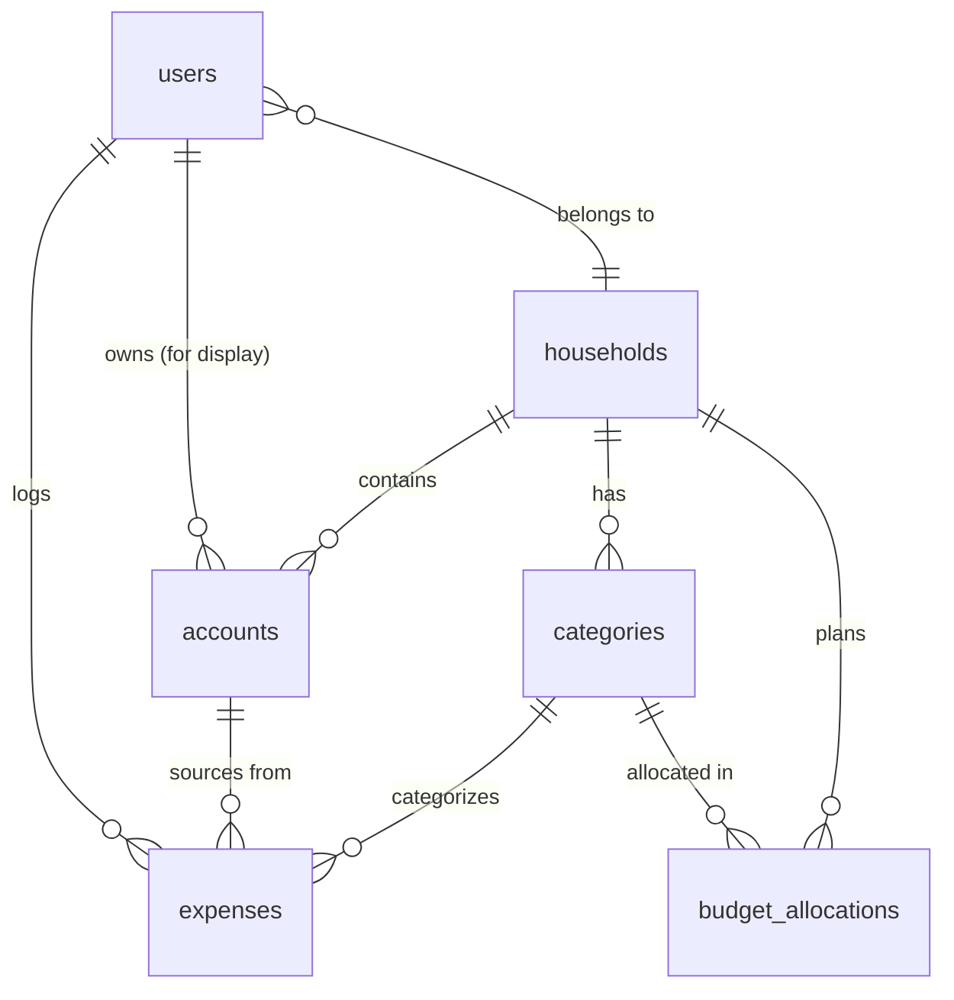

# Data Model

## Overview

Normalized (2NF-3NF) approach optimized for transactional workloads with simple analytical queries.

## Entity Relationship Diagram

## Key Design Decisions

### 1. Household-Based Sharing Model
All financial data (accounts, categories, budget allocations) is scoped to households. Users belong to exactly one household via `users.household_id`. All household members have full read/write access to household data. Audit trails (`accounts.owner_user_id`, `expenses.logged_by_user_id`) track who performed actions without restricting access. Default categories are auto-seeded on household creation.

### 2. No Budgets Table - Monthly Cadence
No separate budgets table. Monthly periods are represented by `budget_month` (date) fields on `budget_allocations`. Strongly oriented toward monthly planning cycle.

### 3. Categories and Allowances
Both regular expense categories and personal allowances are in the same `categories` table, distinguished by `exclude_from_budget_total` boolean flag. Personal allowances (e.g., "Max's Allowance", "Sam's Allowance") are categories with `exclude_from_budget_total = true`.

All categories receive monthly budget allocations via `budget_allocations` table. The `exclude_from_budget_total` flag determines whether a category's allocation counts toward the household's total monthly budget (used for "our spending" vs "my personal allowance"). Categories are household-scoped (not per-month) and reused each month with different allocations.

### 4. Budget Allocations
`budget_allocations` tracks how much is allocated to each category per month (via `budget_month` field). Works for both regular expense categories and personal allowances. Allows easy rebalancing and clear separation between plan (allocation) and actual (expenses).

### 5. Multi-Currency Support
Expenses store both original currency/amount and converted amount with exchange rate preserved directly on each expense record for historical accuracy.
