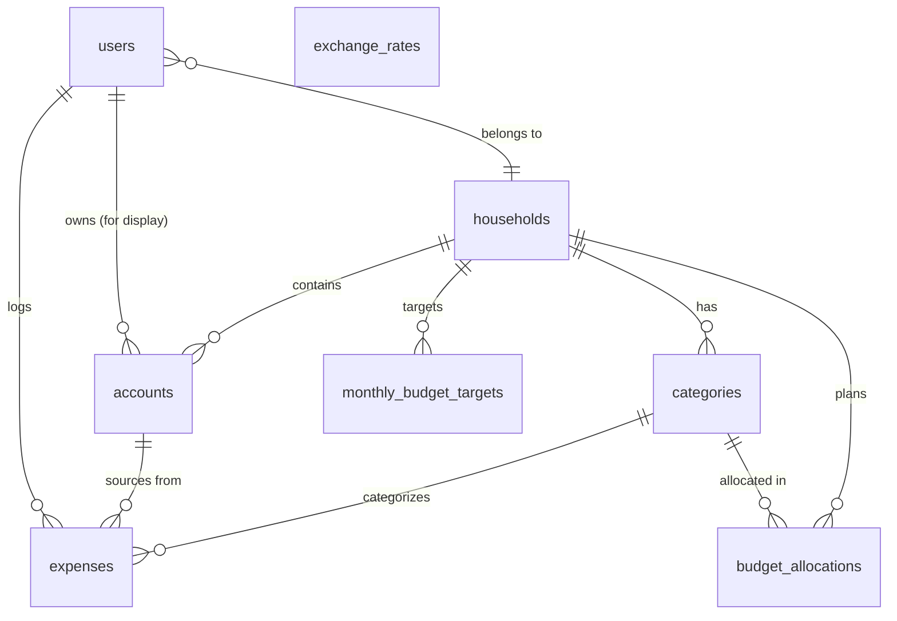

# Data Model

## Overview

Normalized (2NF-3NF) approach optimized for transactional workloads with simple analytical queries.

## Entity Relationship Diagram

## Key Design Decisions

### 1. Household-Based Sharing Model
All financial data (accounts, categories, budget allocations) is scoped to households. Users belong to exactly one household via `users.household_id`. Audit trails (`accounts.owner_user_id`, `expenses.logged_by_user_id`) track who performed actions without restricting access.

### 2. No Budgets Table - Monthly Cadence
No separate budgets table. Monthly periods are represented by `budget_month` (date) fields on `budget_allocations`. Strongly oriented toward monthly planning cycle.

### 3. Categories and Allowances
Both regular expense categories and personal allowances are in the same `categories` table, distinguished by `exclude_from_budget_total` boolean flag. Personal allowances (e.g., "Max's Allowance", "Sam's Allowance") are categories with `exclude_from_budget_total = true`. This flag determines whether a category's allocation counts toward the household's total monthly budget ("our spending" vs "my personal allowance").

### 4. Monthly Budget Target & Unallocated Pool
`monthly_budget_targets` stores an optional per-month total budget figure for a household (`household_id`, `budget_month`, `target_amount`). It covers the sum of regular categories only — allowances live outside it. When a row exists, the "unallocated pool" is computed as `target_amount − sum(regular allocations)` and can be assigned mid-month via the `allocate_from_unallocated` RPC, which re-validates the constraint under a row lock to prevent races. No row = no target = legacy behaviour.
