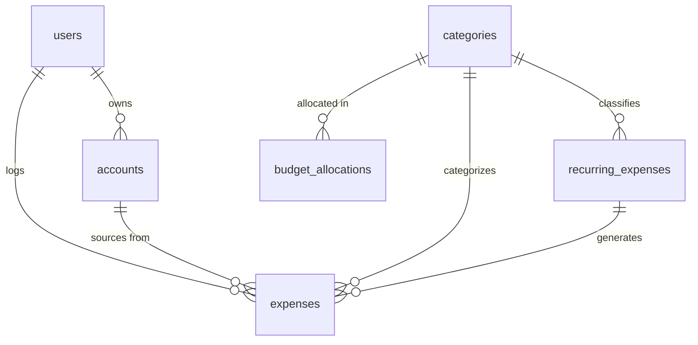

# Data Model

## Overview

Normalized (2NF-3NF) approach optimized for transactional workloads with simple analytical queries.

## Entity Relationship Diagram

## Key Design Decisions

### 1. No Budgets Table - Monthly Cadence
No separate budgets table. Monthly periods are represented by `budget_month` (date) fields on `budget_allocations`. Strongly oriented toward monthly planning cycle.

### 2. Categories with Type Flag
Both monthly spending categories and long-term accumulation goals are in the same `categories` table, distinguished by `category_type` (e.g., `monthly` vs `long_term`). Personal allowances are just categories. Categories are global (not per-month) and reused each month with different allocations.

### 3. Budget Allocations
`budget_allocations` tracks how much is allocated to each category per month (via `budget_month` field). Works for both monthly spending categories and long-term accumulation goals. Allows easy rebalancing and clear separation between plan (allocation) and actual (expenses).

### 4. Multi-Currency Support
Expenses store both original currency/amount and converted amount with exchange rate preserved directly on each expense record for historical accuracy.

### 5. Recurring Expenses Linked to Actual Expenses
Recurring expenses (bills, subscriptions) are tracked with frequency and due dates. Each recurring expense generates multiple actual expense records over time, linked via `recurring_expense_id` FK. This ensures all spending is consistently tracked in one place.
