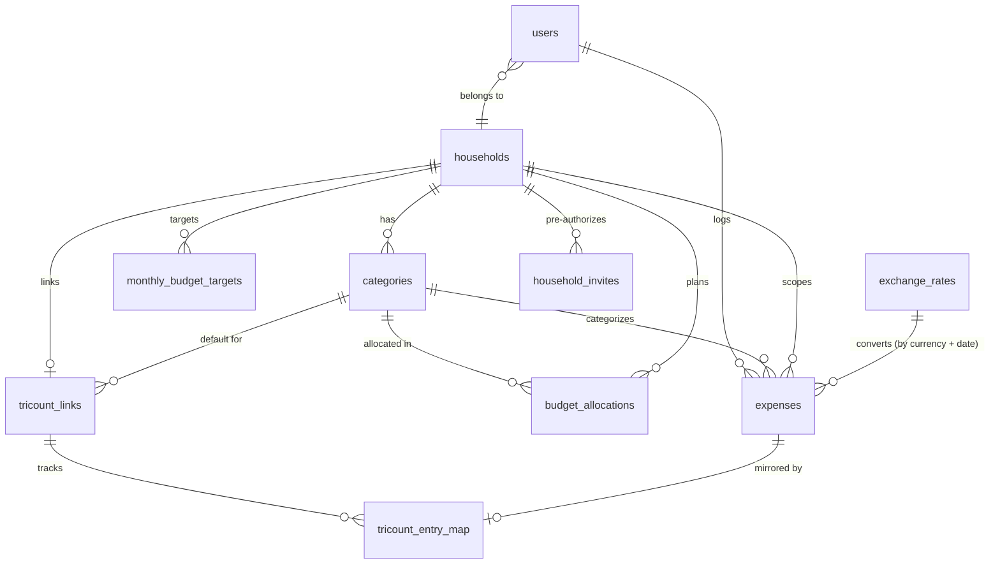

# Data Model

## Overview

Normalized (2NF-3NF) approach optimized for transactional workloads with simple analytical queries.

## Entity Relationship Diagram

## Key Design Decisions

### 1. Household-Based Sharing Model
All financial data (categories, expenses, budget allocations, monthly targets) is scoped to households. Users belong to exactly one household via `users.household_id`. `expenses.logged_by_user_id` records who entered each row as an audit trail, without restricting visibility — every household member sees every expense. The column is nullable with `ON DELETE SET NULL`: deleting a user account anonymizes their audit trail but never deletes the household's shared expense history.

**Signup & household creation.** Households are created self-service at `/signup` (no admin provisioning — there is no service-role key in the app). The single `handle_new_user()` trigger on `auth.users` (declared in `supabase/schemas/01_functions.sql`) branches on whether the new user's email matches an unconsumed `household_invites` row (case-insensitive):

- **Founder path** (no matching invite): creates the household reading `household_name` / `base_currency` / `secondary_currency` from the signup form's `raw_user_meta_data` (falling back to `"<name>'s Household"` / `EUR` / `BRL`), inserts the `public.users` row, seeds a default starter set of categories (6 spending categories mirroring `supabase/seeds/02_seed_categories.sql`, plus the founder's own `exclude_from_budget_total` allowance named from their `full_name`), and writes one `household_invites` row per partner email in `raw_user_meta_data.invite_emails` (lowercased/trimmed, skipping blanks and the founder's own address, capped at 10 — the trigger `LIMIT` mirrors the form's `MAX_PARTNER_EMAILS` and bounds what a crafted direct `auth.signUp` call can write). The metadata currencies are **clamped** in the trigger (uppercased; a non-`^[A-Z]{3}$` value falls back to the default, an equal pair falls back the secondary) because `raw_user_meta_data` is caller-controlled — anyone can call `auth.signUp` directly, and without the clamp an invalid pair would trip the `households` CHECKs and abort the whole signup with an opaque "Database error saving new user".
- **Invited path** (email matches an unconsumed invite): inserts the `public.users` row pointed at that existing household, stamps *that* invite `consumed_at = NOW()` (by id, so a pending invite from any other household stays open), and creates the joiner's allowance named from the `full_name` *they* provided at signup (email local-part as a fallback) — no new household, no duplicate spending-category seeding. Partner allowances are deliberately **not** pre-seeded by the founder: creating each one at join time from its owner's own name avoids placeholder names and the fragile name-matching rename it would take to fix them up (the tradeoff is that a partner's allowance can't receive a budget allocation before they join). When more than one household has an open invite for the address, the oldest (`ORDER BY created_at`) wins. This is how a second member self-joins.

`household_invites` (`household_id`, `email`, `consumed_at`, `created_at`) is the join-authorization ledger: `ON DELETE CASCADE` to `households`, a partial unique index on `(household_id, lower(email)) WHERE consumed_at IS NULL` (at most one outstanding invite per email *per household* — scoped so two households can independently invite the same address; a duplicate within a household is a clean `ON CONFLICT DO NOTHING`), and RLS that is **read-only** to household members — every write happens inside the `SECURITY DEFINER` trigger, which bypasses RLS, so there is deliberately no authenticated INSERT/UPDATE/DELETE policy. The trigger keeps `SET search_path = ''` (all references schema-qualified) and the `REVOKE EXECUTE … FROM PUBLIC, anon, authenticated, service_role` that blocks direct REST/RPC calls. Signups require email confirmation (a Supabase auth setting); the confirmation link routes through the existing `/auth/callback`, so no callback changes were needed. Category and household *management* UIs are deferred — the seeded defaults are the starting point, and the legacy seed flow in `supabase/seeds/01_create_users.sql` (which makes throwaway per-user households via this same trigger, then merges both users into `'Home'`) stays compatible because those throwaways are cascade-deleted and `02_seed_categories.sql` is idempotent.

**Timing — the trigger fires at email confirmation.** `handle_new_user()` returns early while `email_confirmed_at` is NULL and fires from two triggers: `on_auth_user_created` (AFTER INSERT — acts only on rows inserted *already confirmed*, i.e. the seed path and SQL-provisioned users) and `on_auth_user_confirmed` (AFTER UPDATE on the `email_confirmed_at` NULL→NOT NULL transition, hand-authored in `supabase/migrations/20260711160000_fire_handle_new_user_on_email_confirmation.sql` since `auth.users` triggers sit outside the `db diff --schema public` scope). So a real `signUp` materializes nothing at form submission: the household (founder path) or invite consumption (invited path) happens when the confirmation link is clicked, reading whatever `raw_user_meta_data` the auth row carries at that moment. An idempotence guard (skip when the `public.users` row already exists) keeps the two triggers and repeated confirmation-shaped updates from double-firing. Consequences: an abandoned signup leaves a single unconfirmed `auth.users` row (visible under Auth → Users in the dashboard) instead of a ghost household + categories, and a pending invite can only be consumed by someone who can actually read mail at the invited address — squatting an invited email with your own password no longer burns the invite. Residual nuance: an unconfirmed squatter row still *occupies the address in `auth.users`* until deleted; GoTrue handles a repeat `signUp` for an unconfirmed email by updating the password/metadata and re-sending the confirmation, so the real invitee can still claim the address, but a dashboard cleanup of stale unconfirmed users is the tidy path. Note that inviting partners sends them **no email** — only the form submitter is emailed (to confirm their own address); invitees are told to sign up out-of-band. The JWT claim ordering is safe: confirmation commits (trigger included) before GoTrue mints the first session token, so `custom_access_token_hook` finds the `public.users` row.

**Accepted risk — invites pre-claim an address with no consent step.** Whoever signs up with an invited email is routed into the inviting household: their own household name/currency choices are silently ignored (the form warns about this, but only someone who knows they were invited reads it that way), and the household's members see everything they log from then on. There is no invitee-side accept/decline, and invitees get no email. This is acceptable while the `/signup` link is shared privately with people who know each other; revisit before the link travels wider — e.g. a post-confirmation "join X's household or create your own?" choice, or only taking the invited path when the signup omitted household fields.

### 2. No Budgets Table - Monthly Cadence
No separate budgets table. Monthly periods are represented by `budget_month` (date) fields on `budget_allocations`. Strongly oriented toward monthly planning cycle.

### 3. Categories and Allowances
Both regular expense categories and personal allowances are in the same `categories` table, distinguished by `exclude_from_budget_total` boolean flag. Personal allowances (e.g., "Max's Allowance", "Sam's Allowance") are categories with `exclude_from_budget_total = true`. This flag determines whether a category's allocation counts toward the household's total monthly budget ("our spending" vs "my personal allowance").

Every category carries a non-empty `icon` emoji (`icon TEXT NOT NULL` + a `categories_icon_not_empty` CHECK). The expense list shows the icon as the sole category cue on a row whose category name has been replaced by its description as the title, so the icon must always be present.

Regular categories may optionally carry a cap via `cap_amount` (JTBD #8). When a logged amount exceeds the cap, the expense form shows a "Cap" checkbox (styled like the Cash checkbox) inline on the category's budget bar. Ticking it splits the expense into two sibling rows (cap → this category, overflow → an allowance) sharing a `split_group_id`; unticking it logs a single row at the full amount. While capping, each budget bar shows the slice it receives in parentheses, in the household's base currency (e.g. `Dining Out (€10,00)` / `User One (€20,00)`, summing to the entered total), and the overflow allowance bar carries inline person buttons (one per allowance, when more than one exists) to pick where the overflow lands. The edit-expense dialog mirrors the same inline budget-bar treatment, so re-capping an existing expense (or removing/adding a cap) reads identically to logging one — its bars are rebased to exclude the edited expense's own already-counted contribution so the preview reflects the edit rather than double-counting. Caps are denominated in the household's base currency (decision #5) regardless of the expense's input currency — for a foreign entry the form compares `amount × exchange_rate` (the cross-rate into the base currency) against `cap_amount`, and the resulting primary row stores `converted_amount = cap_amount` exactly while the original-currency `amount` absorbs sub-cent rounding. The overflow allowance defaults to the user's last pick (cached in localStorage under `qb:<household>:last_overflow`, persisted on submit and sticky across category changes), falling back to the first allowance for a fresh browser. A single `cap_amount > 0` row-level CHECK enforces positivity; there is no DB-level coupling between a category and a specific allowance.

### 4. Monthly Budget Target & Unallocated Pool
`monthly_budget_targets` stores an optional per-month total budget figure for a household (`household_id`, `budget_month`, `target_amount`). It covers the sum of regular categories only — allowances live outside it. When a row exists, the "unallocated pool" is computed as `target_amount − sum(regular allocations)` and can be assigned mid-month via the `allocate_from_unallocated` RPC, which re-validates the constraint under a row lock to prevent races. No row = no target = legacy behaviour.

### 5. Foreign Currency on Expenses & Per-Household Base Currency
Each household sets its accounting currency via `households.base_currency` (`NOT NULL DEFAULT 'EUR'`, `^[A-Z]{3}$` CHECK) and the secondary/foreign currency offered in the expense form's toggle via `households.secondary_currency` (`NOT NULL DEFAULT 'BRL'`). A `households_currencies_distinct` CHECK enforces `base_currency <> secondary_currency` — they are the two options of the form's currency toggle, so an equal pair would render duplicate buttons. The two are set at household creation (DB/seed-only — there is no in-app settings UI); the original household keeps the EUR/BRL defaults. They're read from the households row in `getServerUser` and carried through `UserData` to the client (`useCurrency`), not injected into the JWT, so a change takes effect without a token refresh.

**`base_currency` is effectively set-once.** Unlike a link's `timezone` (which feeds `content_hash`, so a change self-heals existing Tricount rows on the next sync — decision #9), `content_hash` excludes the converted currency, and manually-logged expenses have no re-derivation path at all. So changing `base_currency` *after* a household has data would leave every existing `converted_amount`/`converted_currency` (and Tricount ledger amount) denominated in the old currency, with no automatic backfill — the figures would silently mix currencies. This is acceptable only because the currency is fixed at household creation with no in-app UI to change it; introducing one would require a one-off backfill that re-converts historical rows.

Expenses store both the original (`amount`, `currency`) and a value converted into the household's base currency (`converted_amount`, `converted_currency` = the base currency, `exchange_rate`). The `exchange_rates` table stays **global and EUR-pivoted**: one `rate_to_eur` per `(currency, rate_date)` pair, populated from Frankfurter (`base=EUR`). Conversion into any household's base currency is derived as a **cross-rate** — `rate(input → base) = rate_to_eur(input) / rate_to_eur(base)` (`fetchConversionRate` in `src/lib/currency.ts`; `getRateToBase` in the Tricount sync) — which short-circuits to `1` when the input already is the base currency and divides by `1` for an EUR base, so EUR households are byte-for-byte unchanged and need no data backfill. Storing the resolved cross-rate on the expense row makes historical totals stable even if a rate is later revised.

### 6. Realtime via Broadcast Triggers
`expenses` and `budget_allocations` publish changes through a `SECURITY DEFINER` trigger that calls `realtime.broadcast_changes()` on a household-scoped topic (`<table>_household_<household_id>`). An RLS policy on `realtime.messages` lets authenticated clients subscribe only to their own household's topics. Source of truth: `supabase/migrations/20260513235951_decouple_realtime_from_declarative_schemas.sql` — owns the function body, trigger creation, publication membership, replica identity, and the `realtime.messages` policy. The matching `CREATE FUNCTION` and `CREATE TRIGGER` declarations in `supabase/schemas/02_tables.sql` are informational stubs that exist only so `supabase db diff --schema public` treats the triggers as known state and does not emit phantom `DROP TRIGGER` statements.

### 7. RLS Helper in `private` Schema
The `get_my_household_id()` helper used by every household-scoped RLS policy lives in a dedicated `private` schema rather than `public`. `private` is intentionally excluded from `db.schemas` in `supabase/config.toml`, so PostgREST does not expose the function as an RPC — only RLS policies (which reference it as `private.get_my_household_id()`) can invoke it. (`pg_graphql` is dropped at the end of the migration chain via `20260514025710_drop_pg_graphql_extension.sql`, but the exclusion still stands as defense-in-depth if it's ever re-enabled.) `authenticated` gets `USAGE` on the schema and `EXECUTE` on the function so policy evaluation works; no other role can call it directly. Source of truth: `supabase/schemas/00_setup.sql` (schema setup) and `supabase/schemas/02_tables.sql` (function definition).

The helper reads `household_id` from the JWT custom claim `app_metadata.household_id` populated by the `private.custom_access_token_hook` auth hook (also in `supabase/schemas/02_tables.sql`). There is **no** fallback: a token without the claim resolves to `NULL` and matches zero rows everywhere (the original `public.users` fallback was removed in `20260514163400_drop_users_fallback_from_get_my_household_id.sql`), so the hook must be enabled before the app serves a project. This collapses the per-query household lookup that RLS used to do — every household-scoped RLS check is a constant-time JWT read. The hook lives in `private` for the same reason as the RLS helper — kept off PostgREST and out of generated TypeScript types, callable only by `supabase_auth_admin`. The hook must be enabled in the Supabase dashboard (Authentication → Hooks → Custom Access Token → `private.custom_access_token_hook`) on Dev and Prod; `supabase/config.toml` only covers local dev. Source of truth for the function/hook pair is the hand-authored migration `supabase/migrations/20260514120000_add_household_id_to_jwt_claims.sql`.

### 8. Split Expenses via Sibling Rows
A single user-facing "split expense" (JTBD #8: cap a shared category, overflow to allowance) is stored as **two sibling rows** in `expenses` sharing a nullable `split_group_id UUID`. The two rows share every metadata field (`household_id`, `logged_by_user_id`, `expense_date`, `description`, `currency`, `exchange_rate`, `is_cash`) and differ only in `category_id`, `amount`, and `converted_amount`. `split_group_id = NULL` means a normal single-row expense. The `id` is minted client-side via `crypto.randomUUID()`; no FK, no parent/child asymmetry. A partial index `idx_expenses_split_group` covers the rare lookups by group id. Because each sibling is a regular `expenses` row, the `budget_summary` view aggregates each portion against its own category naturally — no view, RLS, or realtime changes were needed. The app enforces the two-sibling invariant (the DB does not); an orphan singleton renders as a normal single-row expense, which is visually benign data debt. Reusable client helpers live in `src/lib/split-utils.ts` (`groupSplitSiblings` for list display, `partitionSplitSiblings` to identify primary vs overflow).

### 9. Tricount Sync (read-only mirror)
A household can link one or more Tricount shared ledgers (JTBD #11) and mirror their expenses into Quick Budget. There is no official Tricount API; the sync uses Tricount's undocumented app backend (`api.tricount.bunq.com`) anonymously — generate an app-installation UUID + RSA keypair, `POST /v1/session-registry-installation` for a session token + synthetic user id, then `GET /v1/user/{id}/registry?public_identifier_token=<share-code>`. No signing, no secret. The client (`src/lib/tricount/client.ts`) is server-only; outbound fetch routes through the cloud proxy via `src/instrumentation.ts`.

Two tables back the sync, both household-scoped under the standard `private.get_my_household_id()` RLS policies:

- **`tricount_links`** — one row per connected tricount (`UNIQUE(household_id, public_identifier_token)`, so a household can link several): the share token, cached `title`, the shared `default_category_id` ("Tricount" category synced rows land in, created on first connect and reused by every link), a cached `members` JSONB (`[{id, name}]`, refreshed each sync so the mapping editor renders without a network call), a `member_map` JSONB of **explicit** membership→user decisions (Tricount membership id → QB user id, or `null` to exclude). Mapping is always explicit — there is **no** name-based auto-match — so a membership *absent* from the map is "unset" and contributes nothing until a person assigns it (the UI flags these as "need mapping"). `is_active` lets a household pause a finished tricount: paused links are skipped by `runSyncAll` (manual "Sync all" and the on-load auto-sync), so their mirrored expenses freeze as a historical record; resuming reactivates and re-syncs. A per-link `timezone` (IANA name, `NOT NULL DEFAULT 'Europe/Paris'`) anchors the calendar date each entry's UTC timestamp resolves to (see **Currency & dates** below); it's set on the Sync tab and validated against `Intl.supportedValuesOf("timeZone")` at the API layer. Plus `last_synced_at`. `default_category_id` is `ON DELETE SET NULL`; since `expenses.category_id` is `NOT NULL`, a link whose Tricount category was deleted can't mirror anything — its sync fails fast with a user-facing "unlink and reconnect" message instead of hitting the constraint per entry.
- **`tricount_entry_map`** — the idempotency **and owe/owed reconciliation** ledger, `UNIQUE(link_id, tricount_entry_id)`: maps a stable Tricount registry entry id to the `expenses.id` it produced (nullable — see below), plus a `content_hash` of the Tricount-derived fields (signed share cents, signed paid cents, currency, date, entry description — *not* the EUR rate, so rate caching never causes spurious updates). A row exists for every *reconcilable* entry — ACTIVE `NORMAL` expenses **and** ACTIVE `INCOME`. `expense_id` is `ON DELETE CASCADE` and set only for mirrored budget expenses; **`INCOME` rows carry `expense_id = NULL`** (reconciled for owe/owed, never mirrored as spend). Each row also stores the entry's own `entry_date` plus signed EUR reconciliation amounts — `paid_converted_amount` (household cash flow: the full entry amount when a household member paid, 0 when an outsider did) and `share_converted_amount` (household consumption); both follow Tricount's sign (expense positive, income negative). Deleting a synced expense in-app drops its mapping (cascade) and the next sync re-creates it; income rows have no expense, so removals delete the ledger row directly. This table also drives the UI's read-only tagging: `getSyncedExpenseTitles` joins it to `tricount_links` to map each mirrored `expense_id` → its tricount title (skipping the null-`expense_id` income rows).

**Household-share semantics:** a tricount is a multi-party ledger, but a QB household is just its members. The amount mirrored for each entry is the household's share — the sum of `allocations` whose membership resolves to a household member — not the full expense. Shares belonging to outsiders are excluded, and entries with a zero household share (fully allocated to outsiders) produce no expense; the same applies when the share's EUR conversion rounds to €0.00 (a sub-cent amount would violate the `converted_amount <> 0` CHECK), in which case the entry is reconciled ledger-only like income. Each mirrored entry becomes one regular single-row `expenses` row, filed under the shared Tricount category and attributed (`logged_by_user_id`) to whoever ran the sync. The mirrored row's description is the raw entry text; the originating tricount's name is surfaced in the UI as a read-only tag rather than prefixed into the description. Only `status = ACTIVE`, `type_transaction = NORMAL` entries with a non-zero household share are mirrored as expenses; `INCOME` entries are reconciled for owe/owed but **not** tracked as spend (see "Owe/owed reconciliation" below), and `BALANCE` settlements are skipped entirely.

**Read-only in the app:** mirrored rows are tagged with their tricount name and rendered read-only (edit/delete suppressed) in the expense list and the budget per-category drill-down — they're managed on the Sync tab, not hand-edited. Read-only is enforced by the UI (the card is not tappable and exposes no edit/delete action when `importedFrom` is set), not at the database level: expenses have no API layer and the sync runs in the caller's own `authenticated` session, so RLS cannot distinguish a sync write from a user write. A row deleted out-of-band (e.g. via cascade when its mapping is dropped) is re-created on the next sync, since the Tricount entry still exists; an out-of-band *edit* to a mirrored row, however, is **not** auto-reverted — `content_hash` is computed only from Tricount-derived fields, so the sync skips an entry whose upstream data is unchanged and never reads the expense row back (the edit is reconciled only if/when the Tricount entry itself changes). Detection is by `expense_id` membership in `tricount_entry_map` (precise — a manual expense that happens to sit in the Tricount category stays editable). Removal is a single **Unlink & delete** on the Sync tab: it drops the link, its ledger, and every expense it imported — there is no orphan-leaving "disconnect but keep" variant (that was the pollution source). To keep a finished tricount's expenses as history, **pause** it (`is_active = false`) instead of unlinking.

**Member identity** is per-tricount: the Tricount membership id identifies a person *within that registry*, not a global account, so mapping lives on each link and the editor (`/sync` tab) lets you assign each member to a household person or exclude them. Mapping is always explicit (no auto-match), so on first connect nothing is counted until you assign members and re-sync. Saving writes only the members you changed into `member_map`; the rest stay unset (uncounted).

**Currency & dates:** Tricount serves both `amount` and every `allocation` in the *tricount's base currency* — a foreign-currency entry (e.g. a USD purchase in a EUR tricount) is already converted by Tricount to the base currency before the API returns it (its per-entry `exchange_rate` is informational and ignored). So `expenses.amount` is stored in that tricount base currency and `converted_amount` is computed in the **household's** base currency (decision #5) as a cross-rate off the existing EUR-pivoted `exchange_rates`/Frankfurter path — `getRateToBase` in `sync.ts` (rate 1 when the tricount's base currency already equals the household base; if *either* the entry-currency or the base-currency leg can't be confirmed this run the entry is skipped and retried, like a missing rate). The entry's `date` is a **UTC timestamp** with no timezone in the payload (Tricount's app renders it in the viewer's local zone), so `entryDateOnly` (`src/lib/tricount/mapping.ts`) parses it as UTC and reformats the calendar date in the link's `timezone` — a naive slice would keep the UTC day and land evening/near-midnight entries on the wrong date. `expense_date` and the ledger `entry_date` both flow from this. Because the date feeds `content_hash`, changing a link's timezone re-reconciles affected entries on the next sync (the update path rewrites `expense_date`), so existing rows self-heal without a backfill.

**Owe/owed reconciliation (month-end cashflow):** the mirrored *share* is what the household consumed, not the cash that left its wallet — when a partner fronts a bill more cash left than the share (the household is owed), when an outsider fronts it less did (the household owes). The gap is the household's net Tricount balance, `paid − consumed`, surfaced so month-end cashflow can be reconciled by hand (settling the debt itself is out of scope). The sync reads the per-entry payer (`membership_owned`) and stores, per ledger row, the **signed** `paid_converted_amount` and `share_converted_amount`, denominated in the household's base currency (decision #5) via the same cross-rate as the mirrored expense. A single signed calculation (`src/lib/tricount/mapping.ts`: `signedHouseholdShareCents`, `paidByHouseholdCents`, `mapReconcileEntry`) unifies expenses and income, since Tricount stores expense amounts/allocations negative and income positive. **Income** is included in reconciliation but the app does **not** track it as spend — `INCOME` entries get a ledger row (signed amounts) with **no** budget expense; only `NORMAL` entries with a non-zero household share mirror an expense. Two surfaces consume this: the **budget page** shows the month's actual "cash out" beside the spent line on `BudgetSummaryCard` (`getTricountCashflowAdjustment`) = displayed `totalSpent` + the adjustment, so the month-end cashflow line needs no manual math (the adjustment is `paid − share` per mirrored expense and `paid` per income, since income isn't in the budget total; shown only when Tricount makes cash differ from spent). The remaining hero, bar, and status stay share-based — budget tracking is about consumption, not wallet movement, and the **Sync tab** shows the per-link owe/owed breakdown (`getTricountLinkBalances`: "you paid Y · your share X → you owe/are owed Z", formatted in the household base currency). **Limitation:** the balance is the *accrued* imbalance from `NORMAL` + `INCOME` entries; `BALANCE` settlements are not netted (settling is out of scope), so a finished-but-unsettled or paused tricount still shows its accrued balance, which can differ from Tricount's own post-settlement figure.

**Reconcile loop** (`src/lib/tricount/sync.ts`; `runSync` per link, `runSyncAll` over a household, run by `POST /api/tricount/sync` in the caller's session so RLS applies): pull the whole registry (all months), build the desired set of *reconcilable* entries (`NORMAL` + `INCOME`) keyed by entry id, diff it against `tricount_entry_map`, then insert new entries, update changed ones (hash mismatch), and delete entries that vanished/settled/dropped to a zero household stake. Each reconciled entry writes its ledger row (signed `paid`/`share`, `entry_date`); `NORMAL` entries with a non-zero share also mirror a budget expense (`expense_id` set), `INCOME` does not (`expense_id` null). Concurrent syncs are guarded by the `UNIQUE` ledger constraint — a losing inserter rolls back any orphan expense. Two robustness guards: an entry whose EUR rate can't be fetched live (Frankfurter down, unknown currency) is skipped for the run and retried next sync (`skippedForRate` in the result) rather than written with a hardcoded fallback rate that the rate-less `content_hash` would never correct; and a registry that parses to zero reconcilable entries while the ledger still has rows aborts the link's sync (`EmptyRegistryError`) instead of mass-deleting mirrored expenses on upstream API shape drift. Pure mapping logic (member resolution, share computation, hashing, description composition) lives in `src/lib/tricount/mapping.ts`, is unit-tested, and is shared with the client mapping editor. Sync runs manually ("Sync"/"Sync all" on the `/sync` tab) and automatically once per browser session on app load (`useTricountAutoSync` in the app layout, which syncs all links). To avoid hammering Tricount's undocumented API, the on-load auto-sync passes `auto: true` and `runSyncAll` skips any link whose `last_synced_at` is under `AUTO_SYNC_MIN_INTERVAL_MS` (10 min) old (reported as `throttled`); because the throttle keys off the server-side link row, it dedupes across both partners and all tabs/devices. Manual syncs omit the flag and always force a fresh pull. Because synced rows are ordinary `expenses`, `budget_summary`, realtime, and the expense list need no special handling.
