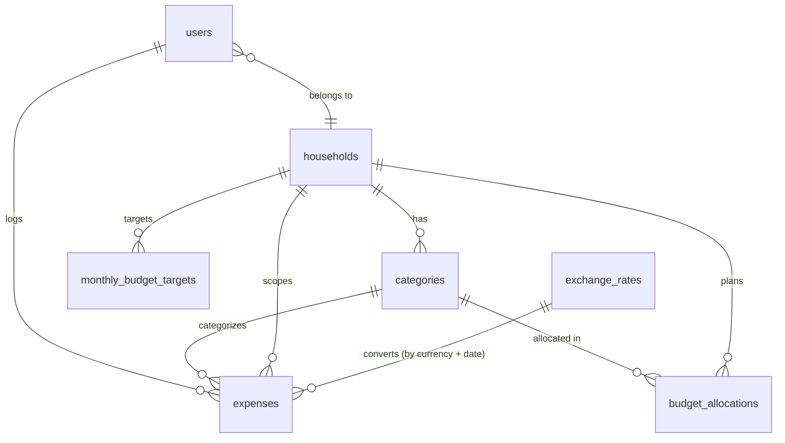

# Data Model

## Overview

Normalized (2NF-3NF) approach optimized for transactional workloads with simple analytical queries.

## Entity Relationship Diagram

## Key Design Decisions

### 1. Household-Based Sharing Model
All financial data (categories, expenses, budget allocations, monthly targets) is scoped to households. Users belong to exactly one household via `users.household_id`. `expenses.logged_by_user_id` records who entered each row as an audit trail, without restricting visibility — every household member sees every expense.

### 2. No Budgets Table - Monthly Cadence
No separate budgets table. Monthly periods are represented by `budget_month` (date) fields on `budget_allocations`. Strongly oriented toward monthly planning cycle.

### 3. Categories and Allowances
Both regular expense categories and personal allowances are in the same `categories` table, distinguished by `exclude_from_budget_total` boolean flag. Personal allowances (e.g., "Max's Allowance", "Sam's Allowance") are categories with `exclude_from_budget_total = true`. This flag determines whether a category's allocation counts toward the household's total monthly budget ("our spending" vs "my personal allowance").

### 4. Monthly Budget Target & Unallocated Pool
`monthly_budget_targets` stores an optional per-month total budget figure for a household (`household_id`, `budget_month`, `target_amount`). It covers the sum of regular categories only — allowances live outside it. When a row exists, the "unallocated pool" is computed as `target_amount − sum(regular allocations)` and can be assigned mid-month via the `allocate_from_unallocated` RPC, which re-validates the constraint under a row lock to prevent races. No row = no target = legacy behaviour.

### 5. Foreign Currency on Expenses
Expenses store both the original (`amount`, `currency`) and a converted value (`converted_amount`, `converted_currency`, `exchange_rate`). The `exchange_rates` table holds one `rate_to_eur` per `(currency, rate_date)` pair, populated from Frankfurter. Storing the rate on the expense row makes historical totals stable even if a rate is later revised.

### 6. Realtime via Broadcast Triggers
`expenses` and `budget_allocations` publish changes through a `SECURITY DEFINER` trigger that calls `realtime.broadcast_changes()` on a household-scoped topic (`<table>_household_<household_id>`). An RLS policy on `realtime.messages` lets authenticated clients subscribe only to their own household's topics. Source of truth: `supabase/migrations/20260513235951_decouple_realtime_from_declarative_schemas.sql` — owns the function body, trigger creation, publication membership, replica identity, and the `realtime.messages` policy. The matching `CREATE FUNCTION` and `CREATE TRIGGER` declarations in `supabase/schemas/02_tables.sql` are informational stubs that exist only so `supabase db diff --schema public` treats the triggers as known state and does not emit phantom `DROP TRIGGER` statements.

### 7. RLS Helper in `private` Schema
The `get_my_household_id()` helper used by every household-scoped RLS policy lives in a dedicated `private` schema rather than `public`. `private` is intentionally excluded from `db.schemas` in `supabase/config.toml`, so PostgREST does not expose the function as an RPC — only RLS policies (which reference it as `private.get_my_household_id()`) can invoke it. (`pg_graphql` is dropped at the end of the migration chain via `20260514025710_drop_pg_graphql_extension.sql`, but the exclusion still stands as defense-in-depth if it's ever re-enabled.) `authenticated` gets `USAGE` on the schema and `EXECUTE` on the function so policy evaluation works; no other role can call it directly. Source of truth: `supabase/schemas/00_setup.sql` (schema setup) and `supabase/schemas/02_tables.sql` (function definition).

The helper reads `household_id` from the JWT custom claim `app_metadata.household_id` populated by the `private.custom_access_token_hook` auth hook (also in `supabase/schemas/02_tables.sql`) and falls back to a `public.users` lookup when the claim is absent. This collapses the per-query household lookup that RLS used to do — for sessions whose access tokens carry the claim, every household-scoped RLS check is a constant-time JWT read. The hook lives in `private` for the same reason as the RLS helper — kept off PostgREST and out of generated TypeScript types, callable only by `supabase_auth_admin`. The hook must be enabled in the Supabase dashboard (Authentication → Hooks → Custom Access Token → `private.custom_access_token_hook`) on Dev and Prod; `supabase/config.toml` only covers local dev. Source of truth for the function/hook pair is the hand-authored migration `supabase/migrations/20260514120000_add_household_id_to_jwt_claims.sql`.

### 8. Split Expenses via Sibling Rows
A single user-facing "split expense" (JTBD #8: cap a shared category, overflow to allowance) is stored as **two sibling rows** in `expenses` sharing a nullable `split_group_id UUID`. The two rows share every metadata field (`household_id`, `logged_by_user_id`, `expense_date`, `description`, `currency`, `exchange_rate`, `is_cash`) and differ only in `category_id`, `amount`, and `converted_amount`. `split_group_id = NULL` means a normal single-row expense. The `id` is minted client-side via `crypto.randomUUID()`; no FK, no parent/child asymmetry. A partial index `idx_expenses_split_group` covers the rare lookups by group id. Because each sibling is a regular `expenses` row, the `budget_summary` view aggregates each portion against its own category naturally — no view, RLS, or realtime changes were needed. The app enforces the two-sibling invariant (the DB does not); an orphan singleton renders as a normal single-row expense, which is visually benign data debt. Reusable client helpers live in `src/lib/split-utils.ts` (`groupSplitSiblings` for list display, `partitionSplitSiblings` to identify primary vs overflow).
