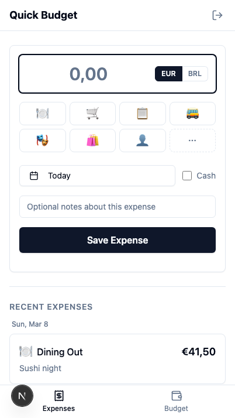
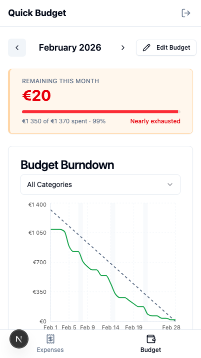

# Quick Budget

Fast expense tracking and flexible budgeting for partners. Used daily by a two-person household splitting expenses across EUR and BRL.

Scope: running discretionary spending only. Rent, subscriptions, and other fixed costs are netted out upstream — the monthly target represents what's left to spend day-to-day, so even spending across the month is a realistic baseline.

<p align="center">
  
  &nbsp;&nbsp;
  
</p>

- Log expenses in seconds, including in foreign currency with automatic conversion
- Shared budget dashboard with real-time sync between partners
- Mid-month rebalancing — move money between categories when priorities shift
- Budget vs actuals history to set more realistic targets each month
- Personal allowances tracked separately from shared spending

## Background

This is the third iteration of a personal finance tool:

1. **[personal-expense-tracker](https://github.com/tucared/personal-expense-tracker)** — Notion + Google Sheets + GCP data pipeline. Overengineered: logging and viewing were split across tools, so keeping up with expenses never became a habit.
2. **[expense-tracker](https://github.com/tucared/expense-tracker)** — Observable Framework dashboard. More of a proof of concept — clunky to deploy and mixing JS with Markdown felt like a step down.
3. **Quick Budget** — Decided to try fully vibecoding a complete app with [Claude Code](https://claude.ai/claude-code). Every line of React, SQL, and infra config was AI-generated. We switched to it from day one — both of us — without keeping the old system around. Light touches and iterations done via Claude Code web.

## Stack

- **Frontend**: Next.js 16 + TypeScript + Tailwind CSS v4 + shadcn/ui
- **Backend**: Supabase (PostgreSQL + Auth + Real-time)
- **Deployment**: Vercel + Supabase Cloud

## Local Development

### Prerequisites

- Node.js 18+
- Docker Desktop ([download](https://docs.docker.com/desktop/))
- Supabase CLI: `brew install supabase/tap/supabase`

### Quick Start

```bash
npm ci                # Strict install from package-lock.json
supabase start        # First run takes ~3 min to download images
npm run dev
```

Visit http://localhost:3000 — login with `user1@example.com` / `password1`

### Useful URLs

| URL | What |
|-----|------|
| http://localhost:3000 | App |
| http://localhost:54323 | Supabase Studio (DB UI) |
| http://localhost:54324 | Mailpit (email testing) |

### Key Commands

```bash
supabase start              # Start all services
supabase stop               # Stop all services
supabase db reset           # Reset DB + reapply migrations + seeds
npm run dev                 # Start Next.js dev server
npm run build               # Production build
npm run lint                # Run ESLint
npm run types:generate      # Regenerate TypeScript types from DB schema
```

## Database

Schema is defined declaratively in `supabase/schemas/`. To make changes:

```bash
# 1. Edit schema files in supabase/schemas/
# 2. Generate a migration from the diff
supabase db diff -f descriptive_name
# 3. Verify locally
supabase db reset
# 4. Push to production
supabase db push
```

Seeds in `supabase/seeds/` provide ~3 months of fake data (two users, shared household, budget allocations, expenses, exchange rates).

After schema changes, always regenerate types: `npm run types:generate`

## Design

Functionalist visual direction inspired by Dieter Rams and Braun industrial design — information-dense, zero decoration, quiet typography.

- **Palette**: Warm grays (off-white backgrounds, warm borders). Single accent color: Braun orange for focus states, warnings, and active elements.
- **Status colors**: Muted and functional — teal for on-track, orange for warning, brick red for over-budget. No decorative color.
- **Surfaces**: Completely flat. No shadows on cards or buttons. Expense rows use hairline dividers instead of bordered cards.
- **Typography**: DM Sans. Normal-case labels everywhere — no tracked uppercase. Section headings are small and quiet (`text-xs font-medium`). Hierarchy comes from size and weight, not decoration.
- **Density**: Tight spacing throughout. The expense form uses `space-y-3` with no outer card border. Category budget cards show colored percentage text without bullet indicators.

## Documentation

- **[DEPLOYMENT.md](./DEPLOYMENT.md)** — Production deployment guide
- **[DATA_MODEL.md](./DATA_MODEL.md)** — Database schema and design decisions
- **[PROGRESS.md](./PROGRESS.md)** — Feature roadmap

## License

MIT
